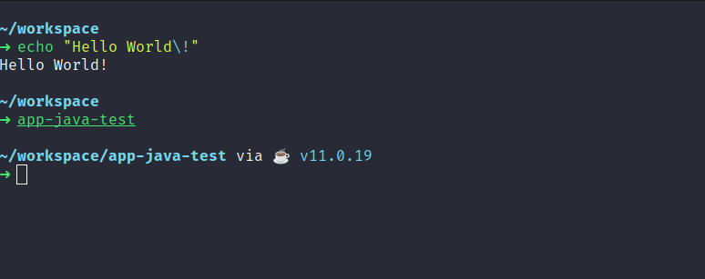

# Guia de instalação do ZSH

O Z-Shell muito conhecido como ZSH é um interpretador de comandos UNIX que oferece vários recursos facilatam muito a vida de quem utiliza a linha de comando.

Para economizar tempo durante a instalação e configuração, fiz um script shell para instalar o `zsh` e o framework `oh-my-zsh` assim como alguns plugins. O script também irá realizar a instalação do tema Starship e da fonte firacode. Para executar o script basta clonar esse repositório e executar o arquivo `install-zsh.sh` conforme abaixo.

```shell
$ sudo ./install-zsh.sh
```

Caso queira realizar o processo de instalação manualmente basta seguir os seguintes passos

Instalar o `zsh` 

```shell
$ sudo apt install -y zsh
```

Instalar o framework oh-my-zsh Utilizando `curl`

```shell
$ sh -c "$(curl -fsSL https://raw.githubusercontent.com/robbyrussell/oh-my-zsh/master/tools/install.sh)"
```

Tornar o ZSH o shell padrão do Ubuntu. Para que assim, toda vez que o terminal for aberto já seja executado o zsh ao invés do bash.

```shell
$ chsh -s $(which zsh)
```

## Adicionando plugins

Apśo instalação do zsh e do oh-my-zsh podemos adicionar vários puglins para potencializar o uso do shell. Por exemplo os pluins zsh syntax highlighting e zsh autosuggestions.

### zsh-autosuggestions & zsh-syntax-highlighting

Para instalar os plugins é necessário fazer o download usando `git` na pasta de plugins do oh-my-zsh `${ZSH_CUSTOM}/pugins`

```shell
$ git clone https://github.com/zsh-users/zsh-autosuggestions.git ~/.oh-my-zsh/custom/plugins/zsh-autosuggestions
```

```shell
$ git clone https://github.com/zsh-users/zsh-syntax-highlighting.git ~/.oh-my-zsh/custom/plugins/zsh-syntax-highlighting
```

Posteriormente basta ativar os plugins no arquivo `.zshrc` adicionando-os em

```
plugins=(
    ... 
    zsh-autosuggestions 
    zsh-syntax-highlighting
)
```

## Starship theme

Além dos plugins uso também o tema Starship. Pois gosto bastante de sua integração com os plugins.

A instalação é realizada de modo muito simples. Basta executar o script `shell` de instalação disponibilizado no site oficial do Starship com o seguinte comando

```shell
$ curl -sS https://starship.rs/install.sh | sh
```
Após isso, basta inicializar o tema com o seguinte comando

```shell
$ eval "$(starship init zsh)"
```

### Customização Starship

Além de instalar o tema, também gosto de fazer algumas customizações de como algumas informações são mostradas no terminal. Para isso, basta criar o arquivo de configuração do starship com o comando abaixo

```shell
$ mkdir -p ~/.config && touch ~/.config/starship.toml
```

e adicionar no arquivo `starship.toml` as configurações abaixo

```toml
# Get editor completions based on the config schema
"$schema" = 'https://starship.rs/config-schema.json'

# Inserts a blank line between shell prompts
add_newline = true

# Replace the '❯' symbol in the prompt with '➜'
[character] # The name of the module we are configuring is 'character'
success_symbol = '[➜](bold green)' # The 'success_symbol' segment is being set to '➜' with the color 'bold green'
error_symbol = '[➜](bold red)'

# Disable the package module, hiding it from the prompt completely
[package]
disabled = false

[java]
style = 'cyan'
```

Com essas configurações você terá um terminal parecido com o da imagem abaixo



Caso queira customizar de acordo com sua preferência, dê uma olhada em [Starship Config](https://starship.rs/config/).

### Firacode font

Pode ser que alguns dos ícones do tema starship não sejam redenrizados corretamente em seu terminal. E caso tenha esse problema você pode instalar a fonte `firacode` com o seguinte comando

```shell
$ sudo apt install -y fonts-firacode
```

## Referências

- https://github.com/ohmyzsh/ohmyzsh/wiki/Installing-ZSH
- https://ohmyz.sh/
- https://github.com/ohmyzsh/ohmyzsh/wiki/Settings
- https://gist.github.com/dogrocker/1efb8fd9427779c827058f873b94df95
- https://github.com/spaceship-prompt/spaceship-prompt
- https://github.com/tonsky/FiraCode
- https://starship.rs/config/